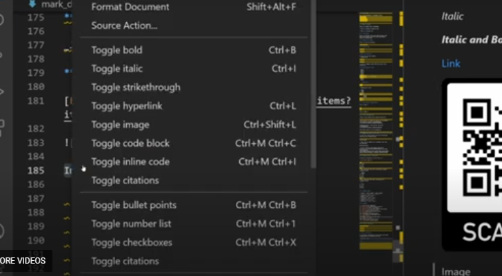

# 1-Heading1
## Heading 2
### Heading3
#### Heading 4
##### so on

# 2-Block of words
This is nirmal text in markdown,

>This is a block of special 
>
>This is seond line

# 3-Line Break
This is 40 days long course data scienece with python 
python AKA 
Python ka chilla with baba Ammar kai sath This is a second line

# 4-combine two things
Block of words and handling

>## heading 2
# 5- Face of text 

**Bold** 

*Italic*

***bold and italic***

Youcan see the symbol use these symbols _underscore

_BOld_

_Italic_

>write in commetnsts abour Bold and Italic with underscore

# 6- bullet points/Lsitss

- Day-1
- Day-2
- Day-3
- Day-4
- Day-5
    - Day-6
        -  Day-7
    - Day-8
- Day-10

>Numbering of Lists

1. Day1
2. Day2
3. Day3
4. Day4
    5. Day5
        6. Day6
    7. Day7
8. Day8

# 7- line breaks or Page breaks
This is page 1.

------
______
******

This is Page 2.
This is Page 3.

# 8- Links and Hyperlinks
<https://github.com/samiyaMalik>

[My Github ID is here](https://github.com/samiyaMalik )

[codanic]:(https://codanics.com/courses/six-months-of-ai-and-data-science-mentorship-program/lesson/learn-markdown-language-in-72-minutes/)
This is Whole Course is [here][codanic]

# 9- Iages and figures with Link
To join this course please scan the following QR code and join telegram group:


> how to comment out markdown line ?
and its shortcut
online picture


# 10- Adding code or code Block
To print a string use `print("codanics")`

`Print("Hellow Gyz how are You")` 

>This code with show coor according to python lanaguge suntax

```python
x = 5+6
y = 3-2
z = x+y
print(z)
```

>This code with  show color according to R language syntax

```r
x = 5+6
y = 3-2
z = x+y
print(z)
```

>This code with  show color according to Html language syntax


```html
x = 5+6
y = 3-2
z = x+y
print(z)
```

# 11- adding tables
| species | petal_length | Sepal_length|
| :---------: |:---------------:|:------------:|
|verginica |18.2|19.2|
|setosa|15.1|17.2|
|versicolor|12.2|12.2|

# 12- content 
[1- Headings](#-1--Heading1)\
[2- Block of words/Citation](#-2--Block-of-words)\
[3- Line Break](#-3--Line-Break)\
[4- combine two things](#-4-combine-two-things)\
[5- Face of text](#5--face-of-text)\
[6- bullet pointslsitss](#6--bullet-pointslsitss)\
[7- line breaks or page breaks](#7--line-breaks-or-page-br\eaks)\
[8- links and hyperlinks](#8--links-and-hyperlinks)\
[9- iages and figures with link](#9--iages-and-figures-with-link)\
[10- adding code or code block](#10--adding-code-or-code-block)\
[11- adding Tables](#11--adding-tables)\
[12- content](#12--content)\
[13- install-extentions](#13-install-extentions)

# 13-Install extentions 

**sample Text**

**Bold**

_italic_

**_italic and Bold_**

[Link](https://codanics.com/courses/six-months-of-ai-and-data-science-mentorship-program/lesson/learn-markdown-language-in-72-minutes/)


> how to comment out markdown line ?
and its shortcut
online picture


Image




